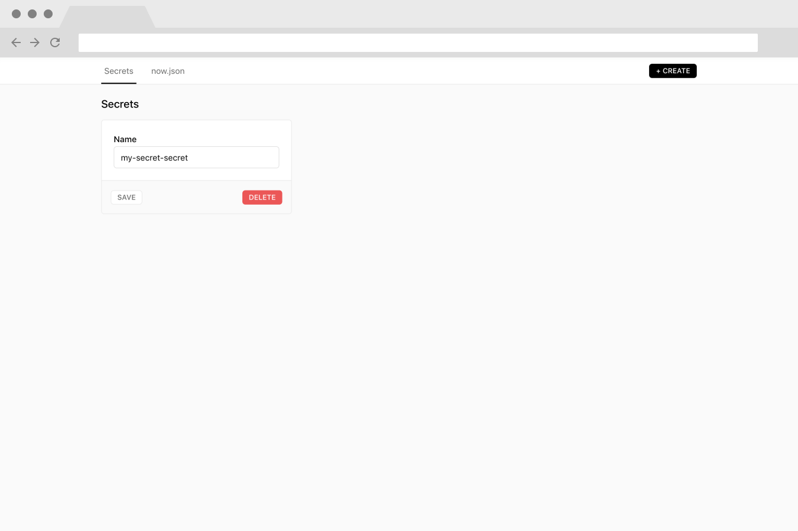
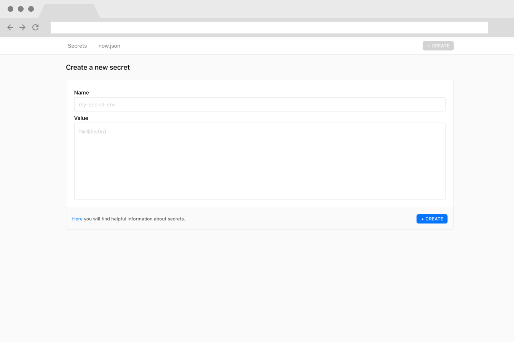
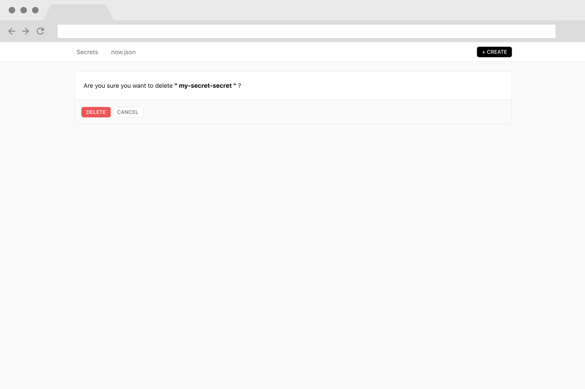

<p align="center">
  
</p>

## zeit-secrets-integration

This allows you to manage your secrets on `zeit.co`.

This Application only uses the [zeit.co api](https://zeit.co/docs/api/) and does **not** safe any of your secret data!

**Marketplace**: [https://zeit.co/integrations/secrets](https://zeit.co/integrations/secrets)

### How to use?

1. Login into [zeit.co](https://zeit.co/)
2. Open [https://zeit.co/integrations/secrets](https://zeit.co/integrations/secrets)
3. Click on the **ADD** Button at the upper right corner
4. Choose your account/team
5. Now find it in your [Integrations Dashboard](https://zeit.co/dashboard/integrations)
6. Click on **Untitled Configuration** and edit all your secrets (:

### Screenshots

<p align="center">
  
</p>

<p align="center">
  
</p>

<p align="center">
  
</p>

<p align="center">
  
</p>

### Development

First add **[now-cli](https://github.com/zeit/now-cli)**

```bash
yarn add global now # or npm install -g now
```

1. Create an Integration at the [Integration Console](https://zeit.co/dashboard/integrations/console) and insert all necessary data.
2. Set the **UI Hook URL** to **http://localhost:5005** and **Privacy** to **Private**.
3. Click **CREATE**
4. You will now see the **VIEW IN MARKETPLACE** button in the upper right corner. Click it and add your integration.
5. Choose a user and go to [Integrations Dashboard](https://zeit.co/dashboard/integrations)
6. Search the integration and click on **Untitled Configuration**.
7. Run:
```bash
yarn # or npm install
#
yarn dev # start the dev server on port 5005
```
and if the server is running, reload your integration page.
